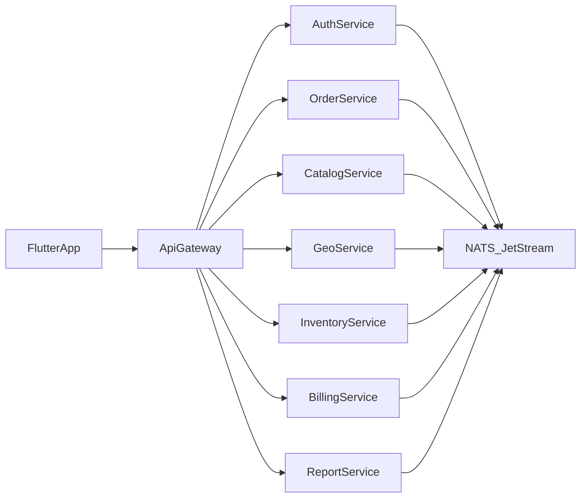
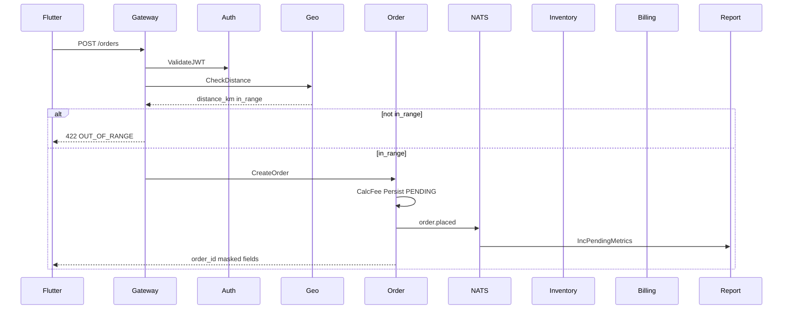
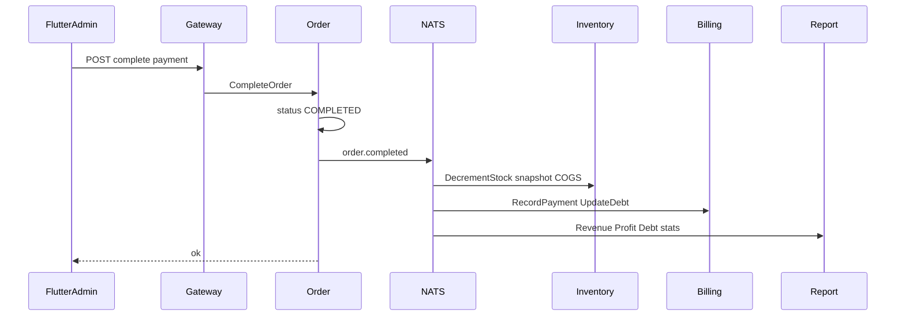
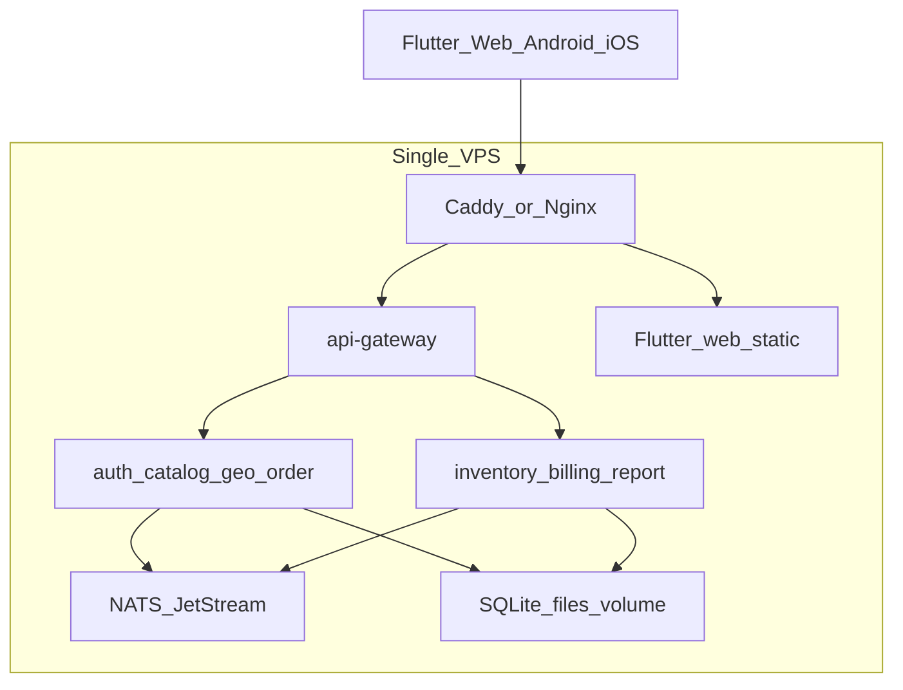

# Gas Tam Đệ — Architecture

> Tech stack, phân tích kỹ thuật, microservice, Event-Driven Architecture, database schema, security, Flutter overview.  
> Sản phẩm & backlog: xem [prd.md](./prd.md).

---

## 1. Mục tiêu kiến trúc

1. Hỗ trợ học **Go microservices + EDA** với ranh giới bounded context rõ.
2. Đủ nhẹ để chạy cửa hàng gia đình **Gas Tam Đệ** trên 1 VPS nhỏ, chi phí thấp.
3. Bảo mật PII (SĐT, địa chỉ); chống IDOR giữa khách hàng.
4. Ưu tiên luồng **đặt giao gas** latency thấp; phần báo cáo cập nhật bất đồng bộ qua events.

> Microservices phục vụ học tập và tách trách nhiệm. Không bắt buộc Kubernetes ở MVP: nhiều process + NATS trên một máy là đủ.

---

## 2. Tech stack

| Layer | Lựa chọn | Lý do |
|-------|----------|--------|
| Frontend | **Flutter** (Web + Android + iOS **song song**) | Một codebase; không trì hoãn iOS; test Web/emulator khi thiếu máy thật |
| Backend | **Go 1.25+** | Mục tiêu học Go; binary nhỏ, deploy đơn giản |
| HTTP | Chi hoặc Fiber (thống nhất một framework/gateway) | Middleware JWT, rate limit |
| DB | **SQLite** — mỗi service một file `*.db`, chế độ WAL | Miễn phí, nhẹ, đủ quy mô gia đình |
| Event bus | **NATS JetStream** | Nhẹ hơn Kafka; durable consumer cho report/inventory |
| Gateway | `api-gateway` (Go) | Điểm vào duy nhất từ Flutter |
| OTP | Interface + mock (local); production: **Stringee SMS REST** (client thật), seam cho eSMS / tương đương VN | Tránh vendor lock |
| Maps / Geo | OSM + Photon/Nominatim (search); Haversine in-house; deep-link Google Maps cho dẫn đường admin | Giảm chi phí API |
| Auth | JWT access (ngắn hạn) + refresh; OTP cho khách; password cho admin | RBAC `customer` \| `admin` |

### 2.1 Gợi ý cấu trúc monorepo

```text
gas-tam-de/
  apps/
    mobile/                 # Flutter (Web + Android + iOS)
  services/
    api-gateway/
    auth-service/
    catalog-service/
    geo-service/
    order-service/          # gồm delivery fee module
    inventory-service/
    billing-service/
    report-service/
  docs/
    prd.md
    architecture.md
  deploy/
    docker-compose.yml      # nats + services (dev)
```

---

## 3. Phân tích requirement (góc kỹ thuật)

| Nhu cầu nghiệp vụ | Hệ quả kỹ thuật |
|-------------------|-----------------|
| CTA đặt gas là luồng chính | Flutter home tối giản; API place-order là critical path (sync) |
| OTP trước khi đặt | auth-service + gateway enforce JWT; bind `phone` vào token claims |
| GPS / search địa chỉ | geo-service proxy geocode; không expose API key phía client nếu dùng vendor trả phí |
| Bán kính so với cửa hàng | `store_settings` + Haversine; quyết định `in_range` trước khi ghi đơn |
| Phí ship bậc km + bật/tắt | Fee rules **trong order-service** (cùng transaction với tạo đơn) |
| Admin list FIFO | Index `orders(status, created_at)`; mặc định `ORDER BY created_at ASC` |
| Dẫn đường | Không cần tự host routing engine MVP: deep-link với lat/lng |
| Hoàn tất + đủ/một phần/nợ | order complete sync → event → billing cập nhật debt |
| Tồn + giá nhập/bán → lãi | inventory snapshot COGS; report aggregate từ events |
| Shop nhỏ, ít tiền | SQLite + NATS; không cloud DB bắt buộc |

**Chốt trừ tồn:** trừ kho khi đơn **COMPLETED** (tránh giữ tồn khi khách hủy / không giao). Order `placed` chỉ ghi nhận nhu cầu; report có thể đếm “đơn chờ”.

---

## 4. Microservice design

### 4.1 Sơ đồ tổng thể



### 4.2 Bounded contexts

| Service | Trách nhiệm | DB file | Gọi sync từ gateway |
|---------|-------------|---------|---------------------|
| `api-gateway` | TLS terminate (hoặc đứng sau reverse proxy), CORS (`CORS_ORIGINS`), JWT validate + RBAC, reverse-proxy route (giữ path `/v1/...`; admin split theo service), rate limit OTP/login/place-order (IP/user, `429` + `Retry-After`), security headers (nosniff / frame deny / referrer / CSP frame-ancestors), generic `502`/`500` (không lộ upstream URL / stack), audit log admin mutating (SQLite `gateway.db` + structured `admin_audit` log), request id | `gateway.db` | — |
| `auth-service` | OTP, session/refresh, admin password, roles | `auth.db` | Có |
| `catalog-service` | Sản phẩm, giá bán, active flag | `catalog.db` | Có |
| `geo-service` | Vị trí CH, `max_radius_km`, distance, geocode/search proxy | `geo.db` | Có |
| `order-service` | Đơn, items, **fee settings/rules**, quote & place | `order.db` | Có |
| `inventory-service` | Tồn, nhập/xuất, giá vốn | `inventory.db` | Có (admin) + async |
| `billing-service` | Thanh toán theo đơn, công nợ KH | `billing.db` | Có (admin) + async |
| `report-service` | Dashboard aggregate read-model | `report.db` | Có (admin read) |

**Không tách `fee-service` riêng:** phí giao nằm trong `order-service` để tránh distributed transaction khi đặt đơn.

### 4.3 Giao tiếp

| Kiểu | Khi nào | Ví dụ |
|------|---------|--------|
| Sync HTTP (qua gateway) | User chờ kết quả | OTP verify, quote, place order, list orders |
| Async NATS JetStream | Side effects | Trừ tồn, cập nhật debt/report |
| Deep-link (client) | Dẫn đường | Flutter mở Google Maps |

### 4.4 API surface (tóm tắt)

**Auth**

- `POST /v1/auth/otp/request` `{ phone }`
- `POST /v1/auth/otp/verify` `{ phone, code }` → tokens
- `POST /v1/auth/admin/login` `{ username, password }`
- `POST /v1/auth/refresh`

**Catalog**

- `GET /v1/products` (active cho khách)
- `GET/POST/PATCH /v1/admin/products`

**Geo**

- `GET /v1/geo/store` (public: lat/lng cửa hàng, radius — không lộ thông tin nhạy cảm khác)
- `GET /v1/geo/search?q=`
- `POST /v1/geo/check` `{ lat, lng }` → `{ distance_km, in_range, max_radius_km }`
- `PUT /v1/admin/geo/store` (admin)

**Orders + Fee**

- `POST /v1/orders/quote` `{ items, lat, lng }`
- `POST /v1/orders` — tạo đơn
- `GET /v1/orders/me` — chỉ đơn của JWT hiện tại
- `GET /v1/admin/orders?status=` — FIFO
- `GET /v1/admin/orders/{id}`
- `POST /v1/admin/orders/{id}/complete` `{ payment_type, amount_paid? }`
- `GET/PUT /v1/admin/delivery-fee`

**Inventory / Billing / Report**

- `GET /v1/admin/inventory` — list `stock_items` (`items[]`, `count`)
- `POST /v1/admin/inventory` — phiếu `IN` / `OUT` / `ADJUST` (body `movement_type`; cập nhật `on_hand` + `cost_price`; ghi `stock_movements`)
  - `IN`: `qty` + `unit_cost` bắt buộc; tạo `stock_items` nếu chưa có (cần `sku`, `name`); `cost_price` = `unit_cost` (giá nhập hiện tại)
  - `OUT`: `qty` bắt buộc; `unit_cost` **luôn** snapshot từ `stock_items.cost_price` tại thời điểm xuất (T7.2.1 COGS); body `unit_cost` bị bỏ qua; MVP cho phép `on_hand` âm
  - `ADJUST`: `delta` (signed, ≠ 0); `qty` lưu `|delta|`; optional `unit_cost` để sửa giá vốn hiện tại (không phải COGS lịch sử)
- `GET /v1/admin/debts`
- `GET /v1/admin/dashboard/summary` — query `day=YYYY-MM-DD` **hoặc** `from`+`to` (inclusive, VN); bỏ trống = hôm nay. Aggregate `daily_stats` (`revenue_vnd`, `cogs_vnd`, `delivery_fee_vnd`, `profit_vnd`, `orders_*`) + `debt_total` từ debt read-model

Mọi response khách hàng: mask `phone` → `090***1234` (ví dụ); không trả `phone_e164` plaintext trừ khi policy admin explicit.

---

## 5. Event-Driven Architecture

### 5.1 Subject naming

Convention: `<bounded_context>.<entity>.<verb_past>`

| Subject | Publisher | Consumers chính | Payload chính |
|---------|-----------|-----------------|---------------|
| `auth.otp.verified` | auth | report (optional metrics) | `user_id`, `phone_hash` |
| `catalog.product.updated` | catalog | inventory (đồng bộ tên/sku), report | `product_id`, `sku`, `sale_price`, `active` |
| `geo.store_config.updated` | geo | order (cache invalidation optional) | `lat`, `lng`, `max_radius_km` |
| `order.placed` | order | report | `order_id`, `total`, `distance_km`, `created_at` |
| `order.completed` | order | inventory, billing, report | `order_id`, `items[]`, `total`, `payment_type`, `amount_paid` |
| `order.cancelled` | order | report | `order_id` |
| `inventory.stock.adjusted` | inventory | report | `product_id`, `delta`, `on_hand` |
| `inventory.low_stock` | inventory | report / (future notify) | `product_id`, `on_hand` |
| `billing.payment.recorded` | billing | report | `order_id`, `amount_paid`, `payment_type` |
| `billing.debt.updated` | billing | report | `customer_key`, `balance` |

### 5.2 Luồng đặt hàng (sync + async)



### 5.3 Luồng hoàn tất giao



### 5.4 Đảm bảo xử lý event

- JetStream **durable consumers** per service (`inventory-order-completed`, `report-order-placed`, `report-order-completed`, `report-billing-debt-updated`, …).
- Consumer **idempotent**: bảng `processed_events(event_id PRIMARY KEY)` trong mỗi DB.
- Payload kèm `event_id` (ULID/UUID), `occurred_at`, `schema_version`.
- Retry với backoff; poison message → DLQ subject `*.dlq` + log cảnh báo admin.

### 5.5 Consistency model

| Dữ liệu | Mô hình |
|---------|---------|
| Đơn hàng + phí | Strong (SQLite transaction trong order-service) |
| Tồn / công nợ / dashboard | Eventual (sau `order.completed`) |
| Quote phí | Read fee rules + geo check tại thời điểm request (có thể hơi lệch nếu admin sửa rule giữa chừng — chấp nhận MVP) |

---

## 6. Database schema

Mỗi service sở hữu schema riêng. Không cross-DB foreign key. Liên kết logic bằng ID (`order_id`, `product_id`, `user_id`, `phone_hash`).

### 6.1 auth.db

```sql
-- users: khách sau OTP
CREATE TABLE users (
  id            TEXT PRIMARY KEY,          -- ULID
  phone_e164_enc BLOB NOT NULL,          -- encrypt at rest
  phone_hash    TEXT NOT NULL UNIQUE,      -- HMAC/SHA lookup
  phone_masked  TEXT NOT NULL,             -- 090***1234
  full_name     TEXT,
  created_at    TEXT NOT NULL,
  updated_at    TEXT NOT NULL
);

CREATE TABLE otp_challenges (
  id            TEXT PRIMARY KEY,
  phone_hash    TEXT NOT NULL,
  code_hash     TEXT NOT NULL,             -- never store raw OTP
  expires_at    TEXT NOT NULL,
  attempts      INTEGER NOT NULL DEFAULT 0,
  consumed_at   TEXT,
  created_at    TEXT NOT NULL
);
CREATE INDEX idx_otp_phone ON otp_challenges(phone_hash, created_at);
CREATE INDEX idx_otp_expires ON otp_challenges(expires_at);

CREATE TABLE sessions (
  id            TEXT PRIMARY KEY,
  user_id       TEXT NOT NULL,
  role          TEXT NOT NULL CHECK(role IN ('customer','admin')),
  refresh_hash  TEXT NOT NULL,
  expires_at    TEXT NOT NULL,
  revoked_at    TEXT,
  created_at    TEXT NOT NULL
);

CREATE TABLE admin_accounts (
  id            TEXT PRIMARY KEY,
  username      TEXT NOT NULL UNIQUE,
  password_hash TEXT NOT NULL,             -- bcrypt (seed T1.2.1; argon2id optional later)
  display_name  TEXT,
  created_at    TEXT NOT NULL,
  disabled_at   TEXT
);

CREATE TABLE audit_logs (
  id            TEXT PRIMARY KEY,
  actor_id      TEXT NOT NULL,
  action        TEXT NOT NULL,
  entity_type   TEXT,
  entity_id     TEXT,
  meta_json     TEXT,                      -- no secrets / raw OTP
  created_at    TEXT NOT NULL
);
```

### 6.2 catalog.db

```sql
CREATE TABLE products (
  id          TEXT PRIMARY KEY,
  sku         TEXT NOT NULL UNIQUE,
  name        TEXT NOT NULL,
  description TEXT,
  unit        TEXT NOT NULL DEFAULT 'binh',
  sale_price  INTEGER NOT NULL CHECK(sale_price >= 0),  -- VND
  active      INTEGER NOT NULL DEFAULT 1 CHECK(active IN (0, 1)),
  image_url   TEXT,
  created_at  TEXT NOT NULL,                            -- RFC3339 UTC
  updated_at  TEXT NOT NULL
);
CREATE INDEX idx_products_active ON products(active, created_at DESC);

-- Price audit (PRD "product_prices"); current price on products.sale_price
CREATE TABLE product_price_history (
  id          TEXT PRIMARY KEY,
  product_id  TEXT NOT NULL REFERENCES products(id),
  sale_price  INTEGER NOT NULL CHECK(sale_price >= 0),
  changed_at  TEXT NOT NULL,
  changed_by  TEXT
);
CREATE INDEX idx_price_history_product ON product_price_history(product_id, changed_at);
```

### 6.3 geo.db

```sql
CREATE TABLE store_settings (
  id              TEXT PRIMARY KEY,        -- singleton row 'default'
  name            TEXT NOT NULL DEFAULT 'Gas Tam Đệ',
  lat             REAL NOT NULL,
  lng             REAL NOT NULL,
  max_radius_km   REAL NOT NULL DEFAULT 10,
  address_text    TEXT,
  updated_at      TEXT NOT NULL,
  updated_by      TEXT
);

CREATE TABLE geocode_cache (
  id          TEXT PRIMARY KEY,
  query_hash  TEXT NOT NULL UNIQUE,
  result_json TEXT NOT NULL,
  expires_at  TEXT NOT NULL
);
```

**Distance:** Haversine giữa `(store.lat, store.lng)` và điểm giao; đơn vị km, làm tròn 2 chữ số thập phân khi hiển thị.

### 6.4 order.db

```sql
CREATE TABLE delivery_fee_settings (
  id          TEXT PRIMARY KEY,            -- singleton row 'default'
  enabled     INTEGER NOT NULL DEFAULT 0 CHECK(enabled IN (0, 1)),
  updated_at  TEXT NOT NULL                -- RFC3339 UTC
);

CREATE TABLE delivery_fee_rules (
  id          TEXT PRIMARY KEY,
  min_km      REAL NOT NULL CHECK(min_km >= 0),              -- inclusive
  max_km      REAL CHECK(max_km IS NULL OR max_km > min_km), -- exclusive; NULL = +inf
  fee_vnd     INTEGER NOT NULL CHECK(fee_vnd >= 0),          -- VND
  sort_order  INTEGER NOT NULL DEFAULT 0,
  active      INTEGER NOT NULL DEFAULT 1 CHECK(active IN (0, 1))
);
CREATE INDEX idx_delivery_fee_rules_active ON delivery_fee_rules(active, sort_order);

CREATE TABLE orders (
  id              TEXT PRIMARY KEY,
  user_id         TEXT NOT NULL,
  customer_name   TEXT NOT NULL,
  phone_hash      TEXT NOT NULL,
  phone_masked    TEXT NOT NULL,
  address_text    TEXT NOT NULL,
  lat             REAL NOT NULL,
  lng             REAL NOT NULL,
  distance_km     REAL NOT NULL,
  delivery_fee    INTEGER NOT NULL,
  subtotal        INTEGER NOT NULL,
  total           INTEGER NOT NULL,
  status          TEXT NOT NULL CHECK(status IN ('PENDING','COMPLETED','CANCELLED')),
  created_at      TEXT NOT NULL,
  completed_at    TEXT,
  cancelled_at    TEXT
);
CREATE INDEX idx_orders_admin_fifo ON orders(status, created_at);
CREATE INDEX idx_orders_user ON orders(user_id, created_at DESC);

CREATE TABLE order_items (
  id           TEXT PRIMARY KEY,
  order_id     TEXT NOT NULL,
  product_id   TEXT NOT NULL,
  product_sku  TEXT NOT NULL,
  product_name TEXT NOT NULL,              -- snapshot
  unit_price   INTEGER NOT NULL,           -- snapshot sale price
  qty          INTEGER NOT NULL,
  line_total   INTEGER NOT NULL
);
CREATE INDEX idx_order_items_order ON order_items(order_id);

CREATE TABLE processed_events (
  event_id    TEXT PRIMARY KEY,
  processed_at TEXT NOT NULL
);
```

**Ví dụ bậc phí (admin setup):**

| min_km | max_km | fee_vnd |
|--------|--------|---------|
| 0 | 5 | 10000 |
| 5 | 10 | 20000 |
| 10 | NULL | 30000 |

Nếu `max_radius_km = 10`, bậc `> 10` không bao giờ áp dụng cho đơn hợp lệ (đơn ngoài bán kính bị từ chối trước). Khi admin nới bán kính, bậc tương ứng có hiệu lực.

### 6.5 inventory.db

```sql
-- T7.1.1: on_hand may be negative (MVP); cost_price / reorder_level >= 0.
CREATE TABLE stock_items (
  product_id     TEXT PRIMARY KEY,
  sku            TEXT NOT NULL UNIQUE,
  name           TEXT NOT NULL,
  on_hand        INTEGER NOT NULL DEFAULT 0,   -- may be negative (MVP)
  cost_price     INTEGER NOT NULL DEFAULT 0 CHECK(cost_price >= 0),  -- VND giá nhập hiện tại
  reorder_level  INTEGER NOT NULL DEFAULT 0 CHECK(reorder_level >= 0),
  updated_at     TEXT NOT NULL
);

CREATE TABLE stock_movements (
  id            TEXT PRIMARY KEY,
  product_id    TEXT NOT NULL,
  movement_type TEXT NOT NULL CHECK(movement_type IN ('IN','OUT','ADJUST')),
  qty           INTEGER NOT NULL CHECK(qty > 0), -- luôn > 0; sign theo type
  unit_cost     INTEGER CHECK(unit_cost IS NULL OR unit_cost >= 0), -- IN/OUT bắt buộc (app); OUT = COGS snapshot
  note          TEXT,
  ref_type      TEXT,                          -- ORDER / MANUAL
  ref_id        TEXT,
  created_at    TEXT NOT NULL,
  created_by    TEXT
);
CREATE INDEX idx_movements_product ON stock_movements(product_id, created_at);

CREATE TABLE processed_events (
  event_id     TEXT PRIMARY KEY,
  processed_at TEXT NOT NULL
);
```

**COGS snapshot (T7.2.1):** Mọi phiếu `OUT` (admin xuất tay `ref_type=MANUAL` và bán qua `order.completed` `ref_type=ORDER`) ghi `stock_movements.unit_cost = stock_items.cost_price` **tại thời điểm xuất**. Dòng movement là append-only: IN/ADJUST sau đó chỉ cập nhật `stock_items.cost_price` hiện tại, **không** sửa `unit_cost` của OUT cũ. Report (T7.2.2) dùng `sum(qty * unit_cost)` trên OUT/`ORDER` làm giá vốn hàng bán.

Khi `order.completed`: inventory-service durable consumer `inventory-order-completed` (T7.1.3) với mỗi item → `OUT` (`ref_type=ORDER`, `ref_id=order_id`) với `unit_cost = stock_items.cost_price` (snapshot), giảm `on_hand`, ghi `processed_events(event_id)`. **Không** trừ tồn trên `order.placed`. Nếu `on_hand` không đủ / SP chưa có trong kho: **MVP cho phép âm** (tạo stock placeholder `cost_price=0` nếu thiếu) + (future) `inventory.low_stock`; admin xử lý tay.

### 6.6 billing.db

```sql
CREATE TABLE payments (
  id            TEXT PRIMARY KEY,
  order_id      TEXT NOT NULL UNIQUE,
  payment_type  TEXT NOT NULL CHECK(payment_type IN ('FULL','PARTIAL','UNPAID')),
  amount_due    INTEGER NOT NULL,
  amount_paid   INTEGER NOT NULL,
  recorded_at   TEXT NOT NULL,
  recorded_by   TEXT NOT NULL
);

CREATE TABLE debts (
  customer_key  TEXT PRIMARY KEY,            -- phone_hash hoặc user_id
  phone_masked  TEXT NOT NULL,
  balance       INTEGER NOT NULL DEFAULT 0,  -- tổng còn nợ
  updated_at    TEXT NOT NULL
);

CREATE TABLE debt_ledger (
  id            TEXT PRIMARY KEY,
  customer_key  TEXT NOT NULL,
  order_id      TEXT,
  delta         INTEGER NOT NULL,            -- + tăng nợ, - giảm nợ
  balance_after INTEGER NOT NULL,
  note          TEXT,
  created_at    TEXT NOT NULL
);

CREATE TABLE processed_events (
  event_id     TEXT PRIMARY KEY,
  processed_at TEXT NOT NULL
);
```

Quy tắc khi complete:

- `FULL`: `amount_paid = amount_due`; debt delta `0` (hoặc xóa nợ gắn order nếu có)
- `PARTIAL`: `0 < amount_paid < amount_due`; debt `+= (amount_due - amount_paid)`
- `UNPAID`: `amount_paid = 0`; debt `+= amount_due`

### 6.7 report.db

```sql
CREATE TABLE daily_stats (
  day            TEXT PRIMARY KEY,           -- YYYY-MM-DD (timezone VN)
  revenue_vnd    INTEGER NOT NULL DEFAULT 0,
  cogs_vnd       INTEGER NOT NULL DEFAULT 0,
  delivery_fee_vnd INTEGER NOT NULL DEFAULT 0,
  orders_completed INTEGER NOT NULL DEFAULT 0,
  orders_placed  INTEGER NOT NULL DEFAULT 0,
  profit_vnd     INTEGER NOT NULL DEFAULT 0  -- revenue - cogs (T7.2.2 MVP)
);

CREATE TABLE dashboard_snapshot (
  id               TEXT PRIMARY KEY,         -- 'current'
  revenue_today    INTEGER NOT NULL,
  revenue_month    INTEGER NOT NULL,
  debt_total       INTEGER NOT NULL,          -- outstanding SUM (T8.1.2)
  profit_month     INTEGER NOT NULL,
  updated_at       TEXT NOT NULL
);

-- Absolute per-customer balances from billing.debt.updated (T8.1.2)
CREATE TABLE customer_debt_balances (
  customer_key TEXT PRIMARY KEY,
  balance      INTEGER NOT NULL DEFAULT 0,
  updated_at   TEXT NOT NULL
);

CREATE TABLE processed_events (
  event_id     TEXT PRIMARY KEY,
  processed_at TEXT NOT NULL
);
```

**Lợi nhuận MVP (T7.2.2):** `profit_vnd = revenue_vnd - cogs_vnd` trên đơn completed trong kỳ (`ComputeProfit` / `BuildDailyStatsAmounts` trong report-service). `revenue_vnd = Σ(qty × unit_price)` (subtotal sản phẩm); `cogs_vnd = Σ(qty × unit_cost)` từ `stock_movements` OUT/`ORDER` snapshot (T7.2.1) — không dùng `stock_items.cost_price` hiện tại. Phí ship theo dõi riêng trên `delivery_fee_vnd` và **không** trừ vào profit.

### 6.8 gateway.db

```sql
-- Admin HTTP audit at gateway edge (T9.1.4). Mutating methods only.
CREATE TABLE admin_audit_logs (
  id          TEXT PRIMARY KEY,
  actor_id    TEXT NOT NULL,               -- JWT sub
  method      TEXT NOT NULL,               -- POST|PUT|PATCH|DELETE
  path        TEXT NOT NULL,               -- e.g. /v1/admin/orders/{id}/complete
  status      INTEGER NOT NULL,            -- HTTP outcome
  request_id  TEXT,
  created_at  TEXT NOT NULL                -- RFC3339 UTC
);
CREATE INDEX idx_admin_audit_created ON admin_audit_logs(created_at DESC);
CREATE INDEX idx_admin_audit_actor ON admin_audit_logs(actor_id, created_at DESC);
```

`auth.db.audit_logs` vẫn dành cho domain audit sau này; gateway ghi **HTTP-level** audit riêng (không cross-write sang auth).

**Consumer → `daily_stats` (T8.1.1):** Durable JetStream consumers `report-order-placed` / `report-order-completed` (stream `ORDERS`), idempotent qua `processed_events`. `order.placed` → `orders_placed++` theo ngày VN (`Asia/Ho_Chi_Minh`). `order.completed` → cộng `revenue` / `cogs` / `delivery_fee` / `orders_completed` rồi `profit = revenue − cogs`. `delivery_fee` lấy từ payload nếu có, không thì `max(0, total − revenue)`. `unit_cost` trên từng item là optional (thiếu → COGS dòng = 0) cho đến khi publisher kèm snapshot.

**API + debt snapshot (T8.1.2):** `GET /v1/admin/dashboard/summary` SUM `daily_stats` theo `day` / `from`–`to` (mặc định hôm nay VN). Durable consumer `report-billing-debt-updated` (stream `BILLING`) upsert `customer_debt_balances` rồi ghi `dashboard_snapshot.debt_total = SUM(balance > 0)`. Tồn kho theo SP dùng `GET /v1/admin/inventory` (không nhồi vào summary).

---

## 7. Security

### 7.1 Nguyên tắc

1. **Zero trust giữa client và service:** mọi request qua gateway; service-to-service dùng mạng private + `X-Internal-Token` (hoặc mTLS sau này).
2. **Least privilege:** JWT claim `role`; admin routes tách prefix `/v1/admin/**`.
3. **Defense in depth:** validate input, rate limit, mask PII, encrypt phone at rest, audit.
4. **Không IDOR:** `GET /orders/me` filter `user_id` từ token; admin mới list all.

### 7.2 Biện pháp cụ thể

| Hạng mục | Thực thi |
|----------|----------|
| Transport | HTTPS (Caddy/Nginx) trước gateway |
| AuthN | JWT access ~15–30 phút; refresh xoay vòng; OTP 6 số, TTL 5 phút, max attempts |
| AuthZ | RBAC middleware; deny by default |
| Rate limit | Gateway: IP (OTP request, admin login) + IP/user (place-order); auth-service: phone_hash + IP cho OTP |
| PII | `phone_e164_enc`; API trả `phone_masked`; log dùng `phone_hash` |
| OTP storage | Chỉ `code_hash`; raw OTP không log |
| Password admin | bcrypt (MVP seed/login); không lưu plaintext |
| Headers | Gateway: `X-Content-Type-Options: nosniff`, `X-Frame-Options: DENY`, `Referrer-Policy: no-referrer`, `Permissions-Policy`, `CSP frame-ancestors 'none'`; strict CSP đầy đủ cho web nếu serve static |
| Secrets | Env / `.env` không commit; tách key mã hóa phone |
| Audit | Gateway: mọi admin mutating (`POST`/`PUT`/`PATCH`/`DELETE` dưới `/v1/admin/**`) → `admin_audit_logs` (actor_id, method, path, status, created_at) + slog `admin_audit`; bao gồm complete order, đổi fee/radius, nhập/xuất kho |
| SQLite | File permission OS; backup mã hóa nếu đưa ra khỏi máy |

### 7.3 Threat notes (MVP)

| Threat | Mitigation |
|--------|------------|
| OTP brute force | Lockout + rate limit + TTL ngắn |
| Enumerate orders | Random ULID; ownership checks |
| Abuse geocode proxy | Rate limit + cache |
| Replay complete | Idempotent complete theo `order_id` status machine |
| Event redelivery | `processed_events` |

---

## 8. Flutter application (overview)

### 8.1 Apps / modes

| Mode | Entrypoint | Màn chính |
|------|------------|-----------|
| Customer | Mặc định | Home (brand **Gas Tam Đệ** + CTA Đặt giao gas), Order flow, Đơn của tôi |
| Admin | Sau login / flavor `admin` | Order Desk, Chi tiết + Dẫn đường, Sản phẩm, Phí giao, Geo CH, Tồn kho, Dashboard |

Có thể dùng **một app** với phân nhánh UI theo `role` trong token (đơn giản cho shop gia đình).

### 8.2 Order flow screens (customer)

1. Home + CTA  
2. Chọn sản phẩm  
3. SĐT → OTP  
4. Họ tên  
5. Địa chỉ (GPS / Search + gợi ý)  
6. Review (phí, tổng) / Outside radius error  
7. Success  

### 8.3 Packages gợi ý

- Điều hướng: `go_router`
- HTTP: `dio` + interceptor gắn JWT
- State: `riverpod` hoặc `bloc` (chọn một, giữ nhất quán)
- Map: `flutter_map` (OSM) hoặc Google Maps plugin nếu chấp nhận key
- Location: `geolocator` (permission + position; Web/Android/iOS)
- Deep-link maps: `url_launcher` → Google Maps directions URL

### 8.4 Multi-platform (Web + Android + iOS)

- **Một UI codebase** cho cả ba target; layout mobile-first, Web responsive cùng flow.
- CTA đặt gas luôn above-the-fold trên home.
- Chọn package có hỗ trợ **web + android + ios** (hoặc có fallback rõ). Tránh khóa feature vào một platform.
- **Test khi không có máy Android thật:**
  1. Flutter Web — vòng lặp dev chính
  2. Android Emulator — permission, GPS giả lập, deep-link
  3. iOS — Simulator (macOS) hoặc CI `macos-latest` build IPA/không ký để bắt lỗi compile sớm

### 8.5 Platform matrix (MVP)

| Khả năng | Web | Android Emulator | iOS Simulator / CI |
|----------|-----|------------------|--------------------|
| Đặt hàng / admin UI | Chính | Có | Có |
| Geolocation | Browser permission | Mock location | Simulator Custom Location |
| Deep-link Maps | `url_launcher` mở maps URL | Intent Google Maps / geo | `maps://` hoặc Google Maps URL |
| OTP SMS | Không nhận SMS trên web giả — dùng mock/dev code | Emulator có thể nhận qua mock provider | Tương tự mock |

---

## 9. Deploy & Repo strategy

### 9.1 Chiến lược Git — monorepo (đã chốt)

**Một repository** `gas-tam-de` chứa toàn bộ: Go services, Flutter (Web + Android + iOS), `deploy/`, `docs/`.

| Cách | Ưu | Nhược | Áp dụng Gas Tam Đệ |
|------|----|-------|---------------------|
| **Monorepo (chọn)** | Một PR cross-cutting API+UI; version đồng bộ; CI đơn giản; đúng quy mô 1–2 người | Repo lớn dần theo thời gian | **MVP và giai đoạn học Go** |
| Polyrepo (`backend` / `frontend` / `mobile` tách) | Quyền truy cập tách bạch; CI độc lập | Đồng bộ contract API khó; overhead thừa khi Flutter đã gộp 3 target | Chỉ cân nhắc khi team/tổ chức tách biệt thật sự |

**Không tách repo `frontend` và `mobile`:** Flutter là một codebase; Web / Android / iOS chỉ khác artifact build (`flutter build web` / `apk`|`aab` / `ipa`), không khác git history.

Cấu trúc thư mục chuẩn: xem [§2.1](#21-gợi-ý-cấu-trúc-monorepo).

**Khi nào mới tách repo sau này**

- Thuê đối tác chỉ làm app và không được xem backend.
- Publish thư viện dùng chung ra ngoài org.
- CI monorepo trở nên chậm không chấp nhận được (hiếm với quy mô này).

### 9.2 Môi trường

| Env | Mục đích | Ghi chú |
|-----|----------|---------|
| `local` | Dev máy cá nhân | `docker compose` (NATS + services); Flutter **Chrome + Android Emulator** (+ iOS Simulator nếu có Mac); OTP mock |
| `staging` (optional) | UAT trước khi lên quán | Cùng compose trên VPS phụ hoặc cùng VPS khác port/subdomain |
| `production` | Cửa hàng Gas Tam Đệ | 1 VPS; HTTPS; SMS OTP thật; backup SQLite |

### 9.3 Kiến trúc deploy MVP



| Thành phần | Cách ship |
|------------|-----------|
| Go services + gateway | Binary hoặc Docker image; `deploy/docker-compose.yml` |
| NATS JetStream | Container trong cùng compose; chỉ listen internal |
| SQLite | Volume trên VPS; WAL mode; không expose file ra ngoài |
| Flutter Web | `flutter build web` → static files qua Caddy/Nginx |
| Android | `flutter build apk` / `appbundle` — nội bộ / Play sau |
| iOS | `flutter build ipa` (cần Mac hoặc CI macOS) — TestFlight / ad hoc; App Store sau |
| TLS / domain | Caddy hoặc Nginx + Let’s Encrypt; ví dụ `api.…` và root cho web |

**Không dùng Kubernetes / service mesh** ở MVP. Nhiều process trên một máy là đủ.

### 9.4 Gợi ý domain

| URL | Vai trò |
|-----|---------|
| `https://gastamde.vn` (ví dụ) | Flutter Web |
| `https://api.gastamde.vn` | API Gateway |
| Admin | Cùng app Web, route `/admin` sau login — không bắt buộc subdomain riêng |

### 9.5 CI/CD tối giản

1. **CI (mỗi PR / push `main`):**
   - `go test ./...` cho services đổi
   - `flutter analyze` (+ test nếu có)
   - Job Linux: `flutter build web`, `flutter build apk` (hoặc `appbundle` debug)
   - Job **macOS** (khuyến nghị từ Sprint 0): `flutter build ios --no-codesign` để bắt lỗi iOS sớm khi không có Mac local
2. **CD production (MVP):** script SSH hoặc GitHub Action:
   - pull tag/commit
   - build/pull images hoặc binaries
   - `docker compose up -d`
   - sync Flutter web build vào thư mục static
3. **Mobile release:** APK/IPA khi cần phân phối nội bộ; không bắt buộc auto-deploy mỗi commit.

Secrets (`JWT_SECRET`, khóa mã hóa phone, SMS API key, `INTERNAL_TOKEN`) chỉ nằm trên VPS / GitHub Actions secrets — **không commit**.

### 9.6 Backup & vận hành

- Cron hàng ngày: checkpoint SQLite rồi copy toàn bộ `*.db` sang ổ/backup ngoài (hoặc object storage rẻ).
- Giữ ít nhất 7 bản gần nhất.
- Health: endpoint `/healthz` trên gateway + mỗi service.
- Log: stdout → journald/docker logs; không log OTP plaintext / full SĐT.

### 9.7 Checklist lên production lần đầu

- [ ] VPS + domain + HTTPS
- [ ] Compose chạy đủ gateway, services, NATS
- [ ] Seed admin account; cấu hình lat/lng cửa hàng + `max_radius_km`
- [ ] OTP provider thật: `SMS_PROVIDER=stringee` + `SMS_API_SID` / `SMS_API_SECRET` / `SMS_SENDER` (brandname đã duyệt), `OTP_DEV_REVEAL=0`
- [ ] Flutter Web publish; APK và/hoặc IPA nội bộ cho CCH
- [ ] Backup cron đã chạy thử restore một lần
- [ ] Rate limit OTP / place-order bật
- [ ] CI macOS iOS build (no codesign) đang xanh

---

## 10. Quyết định thiết kế đã chốt

| Chủ đề | Quyết định |
|--------|------------|
| Tên thương hiệu | **Gas Tam Đệ** |
| Frontend | Flutter **Web + Android + iOS song song** (không trì hoãn iOS) |
| Test thiếu máy thật | Web + Android Emulator; iOS qua Simulator hoặc CI macOS |
| Git | **Monorepo** — không tách backend/frontend/mobile |
| Deploy | **1 VPS** + Docker Compose + Caddy/Nginx |
| Fee service | Gộp trong `order-service` |
| Trừ tồn | Khi `order.completed` |
| DB | SQLite per service + WAL |
| Bus | NATS JetStream |
| Dashboard | Eventual via `report-service` |
| Dẫn đường admin | Deep-link Google Maps / tương đương |

---

## 11. Liên kết

- PRD, MoSCoW, Epic/Story/Task, Sprint: **[prd.md](./prd.md)**
